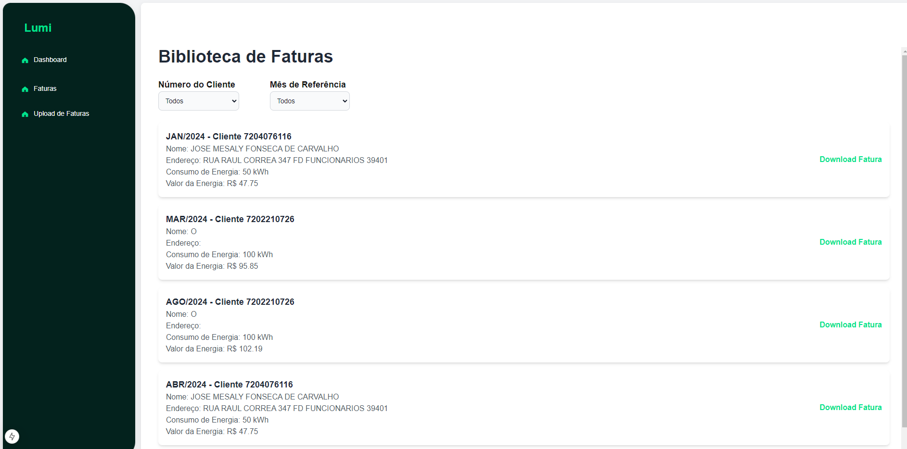
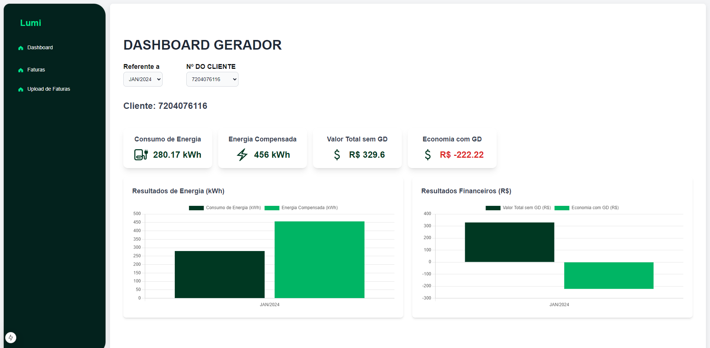
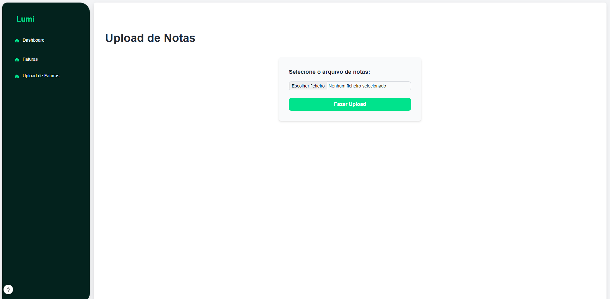

# Sistema de Gerenciamento de Contas de Energia - Frontend

Este projeto é um frontend desenvolvido em **Next.js** com **TypeScript** e **Node 20**, focado em permitir aos usuários visualizar, fazer upload e download, além de analisar contas de energia elétrica. A aplicação oferece uma interface intuitiva para gerenciar as contas, exibindo detalhes específicos e facilitando o acesso aos documentos em PDF.

## Índice
- [Sobre o Projeto](#sobre-o-projeto)
- [Funcionalidades Principais](#funcionalidades-principais)
- [Capturas de Tela](#capturas-de-tela)
- [Configuração do Ambiente](#configuração-do-ambiente)
- [Instalação e Execução](#instalação-e-execução)
- [Variáveis de Ambiente](#variáveis-de-ambiente)
- [Estrutura do Projeto](#estrutura-do-projeto)
- [Tecnologias Utilizadas](#tecnologias-utilizadas)

---

## Sobre o Projeto

Este sistema foi projetado para simplificar a visualização, o upload e a análise de contas de energia elétrica. Integrado ao backend desenvolvido em **Node.js** e **Express**, ele utiliza uma API para gerenciar dados e arquivos, mantendo um fluxo de trabalho eficiente e seguro.

## Funcionalidades Principais

- **Visualização de Contas**: Exibe uma biblioteca de contas de energia com filtros por número do cliente e mês.
- **Upload de Contas**: Permite o upload de arquivos em PDF das contas para análise e arquivamento.
- **Download e Visualização em PDF**: Os usuários podem fazer o download das contas e visualizá-las diretamente no navegador.

## Capturas de Tela

### 1. Biblioteca de Contas
Mostra todas as contas de energia registradas, com filtros para facilitar a busca.



### 2. Detalhe da Conta
Exibe os detalhes específicos de cada conta, incluindo consumo e valor da energia.



### 3. Tela de Upload
Permite que o usuário faça upload de novos arquivos de conta em PDF.



## Configuração do Ambiente

Certifique-se de que o backend da aplicação esteja em execução e que o **Docker** e **Docker Compose** estejam instalados para configurar o banco de dados e a API. As instruções de configuração do backend estão disponíveis no repositório correspondente.

## Instalação e Execução

1. **Clone o repositório**:
   ```bash
   git clone <repo_url>
   cd <repo_name>


Instale as dependências:
npm install

Inicie o servidor de desenvolvimento:
npm run dev

Acesse a aplicação no navegador em: http://localhost:3000

### Variáveis de Ambiente

Crie um arquivo .env na raiz do projeto e defina as seguintes variáveis:
NEXT_PUBLIC_API_URL=http://localhost:3000


NEXT_PUBLIC_API_URL: URL base para o backend da API.

### Estrutura do Projeto

├── components             # Componentes reutilizáveis da UI
├── app                    # Rotas e páginas da aplicação Next.js
│   ├── dashboard          # Página de dashboard
│   ├── fatura             # Página da biblioteca de faturas
│   └── upload-fatura      # Página de upload das faturas
├── public                 # Arquivos públicos (imagens, ícones, etc.)
└── styles                 # Estilos globais e módulos CSS


### Tecnologias Utilizadas

Next.js: Framework React para renderização server-side e geração de sites estáticos.
TypeScript: Suporte a tipagem estática para um código mais seguro e robusto.
Tailwind CSS: Biblioteca de estilos CSS utilitários para rápida criação de layouts.
Docker: Para gerenciamento de containers.
Express API: Para gerenciamento dos endpoints de upload e consulta das contas.


